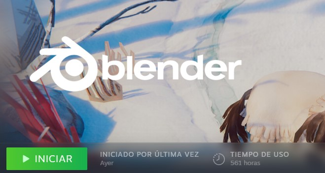

# Presentación
Hola! Mi nombre es Luca.

En mi tiempo libre me gusta editar videos y mirar contenido relacionado a teconologia, últimamente me interesé por la **captura de movimiento** y el **camera tracking**...

# Arranqué a usar Blender a principio de año y ya tengo casi 600 horas...
## Esto no es un chiste, es un **llamado de auxilio**

:skull: :skull: :skull:

Mi instrucción favorita del manual de intel es (No voy a mentir, aun no lo leí)...